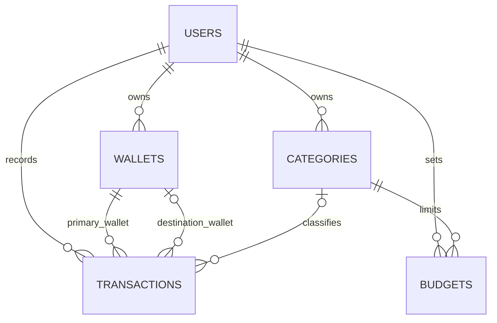
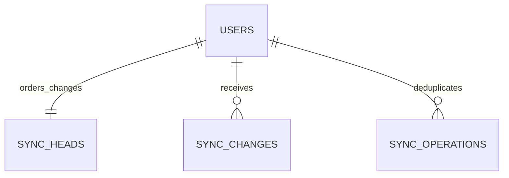

# Money Tracker — Project Requirements

Revision: 0.5 · Date: 14 September 2026 · Status: Core scope confirmed; supporting details proposed

## 1. Purpose

Money Tracker helps people record daily income and expenses, track money across wallets, and understand spending. Users can record transactions without internet after initial online setup. Changes are saved on the device and synchronized with a central server when connectivity permits.

## 2. Decisions and assumptions

| Decision | Status |
|---|---|
| Project name: Money Tracker | Confirmed |
| Frontend: React; backend: Laravel | Confirmed |
| Support Android and iPhone through a mobile web application | Confirmed |
| Allow other people to register | Confirmed |
| Offline entry and automatic synchronization | Confirmed requirement |
| Installable Progressive Web App (PWA) | Proposed implementation |
| Each user has private personal records; no shared wallets initially | Confirmed |
| PHP currency only, displayed as Philippine pesos (₱) | Confirmed |
| Initial core features: income, expenses, wallets, transfers, monthly budgets | Confirmed |
| Debt tracking and savings goals deferred | Confirmed initial scope excludes these |
| Manually entered transactions | Proposed |
| Free initial release with email/password login | Proposed; needs user input |
| MySQL server database and IndexedDB device database | Proposed implementation |

## 3. Users and access

Visitors can register and sign in while online. Registered users manage only their own wallets, categories, transactions, budgets, and exports. Each API operation must verify record ownership using the authenticated user, not a user ID trusted from the request.

An administrator dashboard is outside the proposed first release. Operating the service does not require a product feature that lets administrators browse users' financial entries. Account support and operational monitoring can be specified separately.

## 4. First-release scope

Confirmed core modules: wallets, income, expenses, transfers, and monthly budgets, with private user records and offline synchronization. Authentication and categories support those modules. Dashboard, reports, CSV export, and detailed behavior below remain proposed supporting requirements; they have not been separately confirmed.

| ID | Requirement | Acceptance criterion |
|---|---|---|
| FR-01 | Register, sign in, reset password, and sign out | A registered user can return online and retrieve their synced records; password reset requires internet |
| FR-02 | Create, rename, and archive wallets | Cash, e-wallet, and bank wallets can be tracked separately; archiving retains history |
| FR-03 | Create and archive categories | Income and expense categories remain linked to historical transactions |
| FR-04 | Add income and expenses | Valid entries update local history and balances after local saving succeeds |
| FR-05 | Record wallet transfers | Both wallet effects save atomically; total income and expenses stay unchanged |
| FR-06 | Search, filter, edit, and delete transactions | Filters include date, type, category, and wallet; offline edits and deletions synchronize |
| FR-07 | Show dashboard | Total balance, monthly income, monthly expenses, and recent entries reflect local records |
| FR-08 | Set monthly category budgets | Spending and remaining budget recalculate when relevant expenses change |
| FR-09 | Show reports | Month summaries and category spending reconcile with transaction history |
| FR-10 | Export CSV | Export includes selected transactions, currency, and dates; pending sync status is identified |
| FR-11 | Work offline | Previously initialized app reopens offline and can read, add, edit, and delete local records |
| FR-12 | Synchronize reliably | Retried operations do not duplicate entries; errors retain pending changes |

Later candidates: savings goals, debts and lending, recurring transactions, receipt photos, reminders, shared household wallets, multiple currencies, and bank integrations. These are not committed first-release requirements.

## 5. Screens

Proposed bottom navigation: Home · Transactions · Add · Budgets · More.

| Screen | Contents |
|---|---|
| Welcome and authentication | Registration, login, password reset |
| First setup | Show fixed currency PHP (₱); first wallet, opening balance and opening date |
| Home | Balance overview, month totals, recent entries, sync status |
| Add / edit transaction | Type, amount, wallet, category, date, optional note; destination wallet for transfers |
| Transactions | Search, filters, details, edit, delete |
| Wallets | Wallet list, balances, history, create, rename, archive |
| Budgets | Monthly category limits, spending and remaining amounts |
| Reports | Month totals and spending breakdown |
| Settings | Profile, categories, export, synchronization details, logout |
| Conflict resolution | Local and server versions with an explicit choice |

## 6. Business data

This is a conceptual data dictionary. Exact migrations, constraints, indexes, and API payloads follow after scope decisions.

| Entity | Core fields |
|---|---|
| User | UUID, name, email, password hash on server only, currency, timezone |
| Wallet | UUID, owner, name, type, currency, opening balance in minor units, opening date, archived flag |
| Category | UUID, owner, name, income/expense type, icon, color, archived flag |
| Transaction | UUID, owner, income/expense/transfer type, source wallet, optional destination wallet, category where applicable, amount in minor units, transaction date, note |
| Budget | UUID, owner, category, limit in minor units, start date, end date |
| Pending operation (device) | Unique operation ID, entity and ID, create/update/delete action, payload, base version, status, retry count, last error |
| Sync state (device) | Owner, device ID, last downloaded change cursor, last successful sync time |
| Processed operation (server) | Owner, operation ID, outcome; used to deduplicate retries |
| Change log (server) | Ordered sequence, owner, entity and ID, version, action; includes deletions |

Synchronized business records also need created/updated timestamps, a deletion marker, and a server-controlled version. Create record UUIDs on the device. Partition local records and queues by user.

## 7. Money rules

- Version 1 accepts PHP only. Do not display a currency selector or support currency conversion. Validate PHP on the server as well as the device.
- Store money in integer centavos: ₱150.75 is 15075. Use positive transaction amounts and let type determine their effect.
- Wallet balance = opening balance + income − expenses + incoming transfers − outgoing transfers.
- Income and expense entries require a wallet and a category matching their type.
- Transfers require two different wallets of the supported currency and no income/expense category.
- A transfer is one logical record applied atomically. If a transfer fee exists, record it separately as an expense.
- Budgets measure expenses only. Opening balances and transfers do not count as income or budget spending.
- Archive used wallets/categories instead of removing their history. Exclude archived items from new-entry choices.
- Proposed rule: permit negative wallet balances but flag them; users may enter records late.
- Proposed rule: disallow entries earlier than a wallet's opening date to avoid ambiguous opening-balance calculations.
- Proposed rule: one budget per category per calendar month. Use the user's timezone for period boundaries.

## 8. Main user processes

**First use:** Register online → sign in → show fixed PHP currency and confirm timezone → create first wallet → download/cache required application resources → show offline readiness after initialization succeeds.

**Record expense:** Open Add → select Expense → enter amount, wallet, category and date → validate → write entry and pending operation in one IndexedDB transaction → update screen → attempt synchronization.

**Transfer:** Select source and destination wallets → enter amount/date → validate → save one transfer plus pending operation atomically → recalculate both balances.

**Edit/delete:** Load local record → validate edit or confirm deletion → save updated record or deletion marker with a queued operation → refresh local totals → synchronize later.

**New device:** Sign in online → download records → initialize local database and cached app. Records still pending on another device cannot be restored until that device uploads them.

## 9. Offline and synchronization contract

Screens read local business records. A service worker caches the application resources; IndexedDB stores records and pending operations. The app must confirm successful local storage before displaying a successful save.

Try synchronization after local changes while connected, on opening/resuming the app, after a connectivity event, and through a manual Sync now action. Use background sync where supported, but do not promise immediate upload while the app is closed. Connectivity events are only hints: actual authenticated API responses determine success.

Upload operations in dependency order. The server validates ownership, values and base versions, then records successful operations atomically with their changes. The same operation ID must have the same effect when retried. Remove or mark an operation complete only after acknowledgement. Acknowledging an earlier edit must not clear a later pending edit to that record.

Download changes using an ordered server cursor, including deletion markers. Apply each downloaded batch and advance its cursor together. Do not overwrite unsynced local changes when applying server updates. Preserve enough deletion history, or force a safe full reconciliation when a device cursor is too old.

Retry temporary failures with increasing delays. Keep validation failures visible for correction. Pause uploads on an expired login and request sign-in while preserving local entries. Only the matching account can upload its queued changes.

If two devices change the same version, preserve both versions and ask the user which to keep. Treat edit-versus-delete as a conflict too. Never silently overwrite a financial correction.

Display: Offline; Saved on this device; N changes waiting to sync; Syncing; All changes synced; Sign in to sync; Needs attention. Distinguish locally saved data from server-confirmed data.

## 10. Quality and privacy requirements

- Test actual Android and iPhone browsers and home-screen installations; final browser/version support is a release decision.
- Use HTTPS, secure session handling, server-side authorization, and input validation. Do not store passwords in IndexedDB.
- Offline access uses data already present on the device; it is not a new server login. Define device-access protection before release.
- Handle storage failures visibly; never show a successful save if the local write failed.
- Local storage can be cleared or lost. Request persistence where available and provide exports plus server backups with a restore procedure.
- Show pending changes before sign-out or removal of local data. Do not expose another user's data after account switching.
- Provide readable text, labeled forms, touch-friendly controls and errors that explain how to recover.
- Decide account deletion and data-retention behavior before public registration launches.

## 11. Release verification

1. Create, edit, and delete entries offline; reopen offline; reconnect and verify matching server records.
2. Interrupt upload after server commit but before acknowledgement; retry and verify no duplicates.
3. Create a wallet/category and dependent entries offline; sync all successfully.
4. Edit the same entry on two devices; resolve conflict without losing either candidate prematurely.
5. Delete on one device and edit on another; verify conflict handling and eventual consistent totals.
6. Reconnect with expired authentication; preserve the queue until matching-account login succeeds.
7. Switch accounts and attempt unauthorized record access; verify isolation locally and on the API.
8. Reconcile transfer, opening-balance, monthly-budget, edited-entry and deleted-entry totals.
9. Test browser storage failure and offline app reopening on both target platforms.

## 12. Documentation and build sequence

1. Completed: confirm private records, the five core modules, and PHP-only currency.
2. Write user stories and detailed acceptance criteria for the selected release scope.
3. Completed draft: mobile screen sketches and navigation/field/state specification in section 16.
4. Completed draft: ERD, detailed field dictionary, constraints and offline stores in section 18.
5. Completed draft: authentication, API contracts, sync protocol and conflict handling in section 19.
6. Build a small offline save/reopen/sync prototype before expanding features.
7. Implement core tracking, then budgets/reports; run acceptance tests and prepare deployment.

## 13. Decision log and remaining choices

| Decision | Owner response | Result |
|---|---|---|
| Record visibility | Private | Every user manages their own records; no family sharing in version 1 |
| Core feature scope | Income, expenses, wallets, transfers, monthly budgets are enough | Debt tracking and savings goals stay outside version 1 |
| Currency | Pesos only initially | Fixed PHP currency; no exchange rates or conversion |

Recommended defaults, still proposals: free initial release, email/password registration, English interface, Asia/Manila default timezone (confirm on setup), manual entries, and no administrator dashboard in the first release.

Before implementation, settle registration verification, account deletion/retention, offline device protection, expected user count, hosting budget, and release date. These do not block documenting the core user journeys now.

## 14. Core user stories and screen flows

These stories elaborate the confirmed scope. Form defaults and validation choices remain proposed implementation details.

| Story | User goal | Screen sequence | Acceptance conditions |
|---|---|---|---|
| US-01 | Keep my financial records private | Register → sign in → setup → Home | Another account cannot read or alter my records through screens or direct API calls; local records and queues are isolated |
| US-02 | Set up a wallet | More → Wallets → Add wallet → wallet details | Name and type are required; currency is fixed PHP; opening balance/date save locally and synchronize; opening balance is excluded from income |
| US-03 | Record income | Add → Income → Save → transaction details | Positive amount, owned wallet, income category and date are required; confirmed local save increases balance and selected-period income |
| US-04 | Record an expense offline | Add → Expense → Save → transaction details | Positive amount, owned wallet, expense category and date are required; local balance and spending update without internet; entry remains after offline reopen |
| US-05 | Move money between wallets | Add → Transfer → Save → transaction details | Source and destination are distinct owned wallets; both balance effects occur together; overall balance and income/expense totals remain unchanged |
| US-06 | Control category spending | Budgets → Select month → Add budget → category budget | Positive PHP limit and expense category are required; one limit per category/month; expenses across owned wallets count toward spending; over-budget amount is visible |
| US-07 | Correct a record | Transactions → Details → Edit or Delete | Edits recalculate affected wallets, periods and budgets; deletion requires confirmation; offline changes persist and synchronize without duplicates |
| US-08 | Resume online after offline use | Open/resume app → automatic sync → status update | Pending operations upload once; server changes download; failed or conflicting changes remain visible and recoverable |

Proposed form defaults: today's local date, most recently used active wallet, optional notes, and an amount field suited to decimal entry. Store the amount as integer centavos after validation. Never report a successful save before local storage succeeds.

Budget calculation example: Food budget ₱5,000; food expenses ₱1,200; remaining ₱3,800; used 24%. Transferring ₱500 between wallets leaves these budget values unchanged. Editing a food expense must update the calculation.

Proposed budget form: expense category, calendar month, amount. Show spent, remaining and percent used. A budget is a spending limit; it does not move money between wallets. No automatic rollover in the initial design.

Screen sketches and the detailed layout specification are now drafted in section 16. Database ERD and detailed dictionary are drafted in section 18. Next: synchronization API specification.

## 15. Technical references

- [MDN: IndexedDB](https://developer.mozilla.org/en-US/docs/Web/API/IndexedDB_API)
- [MDN: Background Synchronization API and compatibility](https://developer.mozilla.org/en-US/docs/Web/API/Background_Synchronization_API)
- [web.dev: Offline data and storage](https://web.dev/learn/pwa/offline-data)

These references support the technical direction discussed in this conversation. Recheck platform support during implementation; background behavior is not a universal delivery guarantee.

## 16. Mobile screen plan — revision 0.3

Status: Proposed screen layouts for review, based on confirmed scope. The conversation includes an interactive sketch with sample records. It demonstrates navigation and form layout only; it does not authenticate users, store records, or connect to a synchronization service. The following specification is the durable record of the screen plan.

### 16.1 Shared layout and navigation

Use a single-column mobile layout with an app header, a compact sync status, page content, and bottom navigation. Selected appearance: indigo accents, soft lavender background and white surfaces; see section 17 for the complete palette. Use clear labels and generous touch targets. Dark mode is deferred. Currency is always PHP (₱), with no currency selector.

Bottom destinations: Home, History, Add, Budgets, More. “History” is the short navigation label for the Transactions screen already specified. More includes Wallets, Categories, and Settings; the sketch demonstrates Wallets and synchronization status. Home also links directly to Wallets. Add opens Expense by default, with Income and Transfer available as adjacent choices. First setup has no bottom navigation.

In production, reserve space for the bottom navigation and device safe areas. Keep save actions reachable with the keyboard open. All essential controls must work with touch and keyboard. Targets should be at least 44 by 44 CSS pixels, and editable text should be at least 16 CSS pixels. Test at 320, 375, 390, and 430 CSS-pixel widths, including larger system text.

Keep each transaction-type draft when switching between Expense, Income, and Transfer. Ask before abandoning an unsaved edited form. After a successful local save, clear that saved draft and return to its originating screen with confirmation; Add from main navigation returns to Home. The sketch simplifies this to return to Home.

### 16.2 First setup

Purpose: establish the first wallet after online registration/login.

Top-to-bottom layout:
1. “Create your first wallet” title and short description.
2. Wallet name, required, e.g. Cash.
3. Wallet type, required: Cash, E-wallet, or Bank.
4. Opening balance in pesos, required, default 0.00.
5. Opening date, required, default today.
6. Read-only Philippine peso currency and timezone summary. Provide a timezone correction in the production setup/settings flow.
7. Primary action: Create wallet & continue.

Do not call this wallet money “income.” After the wallet saves, complete app-resource preparation and show Home. Show “Ready for offline use” only after checking that required resources and local records are available. Initial registration and initialization require internet. If setup is interrupted, resume it without creating duplicate wallets.

Validation: reject blank names, invalid amounts and missing dates. Proposed name limit: 60 characters. Preserve entered values after an error. If local storage fails, remain on the form with a retry action; never show success.

### 16.3 Home

Purpose: show where the user's money is and provide a quick entry point.

Top-to-bottom layout:
1. “Your overview” and current month.
2. Total balance across all owned wallets; label it clearly as an all-wallet balance.
3. This month's income and expenses as two separate values.
4. Add transaction action.
5. Wallet balances with View all linking to Wallets.
6. Recent entries with type, wallet, date, amount, and pending status where relevant.
7. Bottom navigation.

Total balance is an overall balance, not income minus expenses for the selected month. Include archived wallet balances in the total if they are nonzero; label them in the wallet list. Income/expense month totals exclude opening balances and transfers.

Empty state: show the opening balance and “No transactions yet” with Add transaction. A returning user with no local records must see a download/loading state, not invented zero balances. If downloading fails, offer retry.

### 16.4 Add expense and add income

Use the same form structure, with type-specific categories and action labels.

| Display order | Field | Behavior |
|---|---|---|
| 1 | Expense / Income / Transfer choices | Expense initially selected; preserve separate drafts when switching |
| 2 | Amount (₱) | Required positive amount, at most two decimal places; decimal keyboard |
| 3 | Wallet | Required active owned wallet; default last-used active wallet where available |
| 4 | Category | Required; filtered to the selected income/expense type |
| 5 | Date | Required; default today in the user's timezone |
| 6 | Note | Optional; describe the transaction |
| 7 | Save expense / Save income | Validate, save locally with queued operation, then confirm |

Expense examples: Food, Transport, Bills. Income examples: Salary, Allowance, Gift. These are starter categories, not a fixed exhaustive set.

No wallet: show Create wallet and preserve the form draft. No usable category: show Add category and preserve the draft. Do not display categories belonging to another user. Keep field-level errors beside fields and move focus to the first invalid field. Protect against duplicate submission while a local write is pending.

Offline confirmation: “Saved on this device. Waiting to sync.” Online confirmation may initially be local; use “Synced” only after acknowledgement. Storage failure: “Couldn't save on this device. Your entry is still here. Try again.”

### 16.5 Transfer

Top-to-bottom layout: transaction type choices; amount (₱); From wallet; To wallet; date; optional note; Save transfer.

Require two distinct active owned wallets. Exclude the selected source from destination choices in production, and validate again on save. With fewer than two wallets, show “Add another wallet to make a transfer” and an Add wallet action. Preserve draft values through that action.

A transfer moves the same amount out of one wallet and into the other in one atomic operation. Use a neutral transfer amount in lists with a directional wallet label, e.g. Bank → GCash. Do not present it as income or an expense. Record any fee separately as an expense.

Proposed negative-balance behavior: allow the transfer but show the resulting negative balance before confirmation. This supports late entry while avoiding an unnoticed overdraft in the record.

### 16.6 Wallets and wallet form

Wallet list layout: title and Add wallet action; overall balance; active wallets with name, type and balance; link to archived wallets. Selecting a wallet opens its transaction history. A Transfer between wallets action opens the transfer form.

The Add wallet form uses the setup fields. The edit flow permits rename and type correction. Opening-balance corrections must trigger balance recalculation and synchronize as a versioned wallet change. Explain their effect before saving. Archive retains transactions and existing balances; prevent new transactions against archived wallets. Restore makes a wallet selectable again.

The sketch shows Cash, GCash, and Bank, and routes a selected wallet to sample history. Full editing, archive/restore, and detailed transaction actions are specified here for implementation.

### 16.7 Monthly budgets and budget form

Budget list layout: title and Add action; month selector; one card per category with category name, spent/limit values, progress bar, remaining amount, percentage used, and Edit.

Form: expense category, calendar month, monthly limit (₱), Save budget. One budget per owned expense category per month. If that budget exists, offer editing it instead of creating a duplicate. For edits, preserve the selected budget's category and month; the sketch uses a sample Food form.

Calculations include expenses across all owned wallets in that category and month, including unsynced local entries. Transfers and opening balances do not affect budgets. No rollover. A zero-spend budget displays the whole limit as remaining. An exceeded budget shows “₱X over budget”; cap the bar visually at 100% while showing the actual percentage numerically. Do not rely on color alone.

Empty month: “No budgets for this month” with Add budget. An existing expense category without a budget is still valid and can receive expenses.

### 16.8 Offline, pending, and recovery states

| State | Display | Available action |
|---|---|---|
| Initialized and offline | Offline; show pending count if nonzero | Continue tracking |
| Locally saved, upload pending | Saved on this device; N changes waiting to sync | Open sync details |
| Sync running | Syncing… | Continue tracking; avoid parallel duplicate sync jobs |
| All confirmed | All changes synced; last successful time in details | Sync now |
| Login expired | Sign in to sync; local changes retained | Sign in to matching account |
| Temporary upload failure | Couldn't sync; pending changes retained | Retry |
| Invalid operation | Change needs attention | Open affected record and correct |
| Conflicting versions | This record changed on another device | Compare local/server versions and choose |
| Local write failed | Couldn't save on this device | Retry while retaining form input |

Background syncing while closed is best effort and browser-dependent. The production guarantee is attempted synchronization on open/resume, reconnect, and manual action when the server and authentication permit it. A Wi-Fi icon alone is not proof of a successful upload.

### 16.9 Consistent sample records

Sample current total: ₱18,500 = Cash ₱3,500 + GCash ₱5,000 + Bank ₱10,000. This month's income is ₱20,000 and expenses ₱1,500; opening balances are zero for this illustration. Food spending is ₱1,200 and Transport spending ₱300. Food's ₱5,000 budget has ₱3,800 remaining (24% used); Transport's ₱2,000 budget has ₱1,700 remaining (15% used).

Recent entries are an excerpt, not the entire ledger: ₱120 Lunch from Cash, a ₱500 Bank-to-GCash transfer, and ₱20,000 Salary into Bank. Balances include transactions not shown in the excerpt. Two sample changes are pending. The mockup's connectivity labels are illustrative and do not detect a real connection.

### 16.10 Review and next deliverable

Screen-planning coverage: setup, Home, income, expense, transfer, wallets, budgets, plus a supporting history screen and synchronization view. Authentication screens, detailed category/settings screens, and conflict dialogs will be elaborated during their respective module design.

Database ERD and data dictionary are now drafted in section 18. Next: API and sync contracts. Existing business rules remain the source of truth. Layout choices are proposals until reviewed; this revision does not authorize new feature modules.

## 17. Selected visual theme

Confirmed preference on 14 September 2026: indigo + soft lavender + white, with semantic transaction colors. This replaces the earlier proposed green appearance and the interim three-color experiments. The following is the light-theme baseline; dark mode remains deferred.

| Use | Color | HEX |
|---|---|---|
| Main buttons, selected tabs, balance card | Indigo | #4F46E5 |
| Page background | Soft lavender | #F5F3FF |
| Cards, inputs, text on indigo | White | #FFFFFF |
| Main text and ordinary amounts | Dark navy | #1E1B4B |
| Secondary text | Slate gray | #64748B |
| Borders | Light gray | #E2E8F0 |
| Income indicators | Emerald | #047857 |
| Expense indicators | Red | #DC2626 |
| Transfer indicators | Blue | #2563EB |

Keep type labels and plus/minus/directional indicators alongside color. Custom category colors are not needed for the initial implementation; icons can distinguish categories.

Category creation must be reachable through More → Categories → Add category and directly from the category field in income/expense forms. Preserve the transaction draft, preselect the matching category type, then select the newly created category on return. Extra income is an income transaction using an appropriate category, such as Freelance Work or Computer Repair; it does not need a separate table or module.

## 18. Database design — draft 1

Prepared: 14 September 2026. Status: proposed implementation specification for the confirmed feature scope. This section refines the earlier conceptual dictionary: use these names and constraints for migrations. No database or application has been deployed by this documentation step.

### 18.1 Architecture and design choices

Use MySQL for server records and IndexedDB for each device's offline records. The same business IDs connect the two stores. Authentication secrets stay on the server or in the selected secure session mechanism; they are never replicated as business data.

Core business tables: users, wallets, categories, transactions, budgets. Server synchronization tables: sync_heads, sync_changes, sync_operations. Device stores: business-record copies, outbox, record_sync_meta, sync_state, sync_conflicts. Login/password-reset/session infrastructure is specified with authentication in the next step and is not part of the financial ERD.

A wallet balance is calculated, not a user-editable balance column. A transfer is one transaction row containing source and destination wallets. Budgets are spending limits, not transactions. All financial records belong to exactly one user.

### 18.2 Core relationship diagram



The primary wallet receives an income, pays an expense, or sends a transfer. The optional destination is required only for transfers. Category is required for income/expense and absent for transfers. Every referenced wallet/category must have the same owner as the transaction/budget.

### 18.3 Conventions used throughout

| Convention | Definition |
|---|---|
| UUID | CHAR(36), canonical lowercase UUID, ASCII binary comparison; same representation in all foreign keys |
| IDs | User IDs generated at registration; business record IDs generated on the device before offline saving |
| Money | Signed BIGINT centavos; ₱1,500.75 is 150075; no floating-point storage or arithmetic |
| Wire/local money representation | Decimal integer strings in JSON and IndexedDB; use BigInt or exact decimal arithmetic for calculations and format only for display |
| Proposed per-value limit | Absolute maximum 999999999999 centavos (₱9,999,999,999.99); positive values required for transactions and budget limits |
| Human dates | DATE formatted YYYY-MM-DD; chosen calendar dates are not converted into UTC timestamps |
| Audit timestamps | DATETIME(6), stored in UTC and assigned by the server after acceptance |
| Ownership | user_id is derived from the authenticated session; validate every referenced record |
| Foreign-key deletion | RESTRICT for business references; no automatic deletion of financial history |
| Text encoding | UTF-8; validate and normalize names consistently before server and device uniqueness checks |
| Versions | BIGINT UNSIGNED, server increments for each accepted mutation; JSON uses decimal strings |
| Null | SQL NULL / JSON null, never an empty-string substitute |

API clients parse amount entry as a decimal string with at most two fraction digits, then convert exactly to centavos. Reject extra decimal digits rather than silently round. Derived totals may exceed the per-entry limit; sum using exact arithmetic. Store signed opening balances to permit a negative starting balance. Future-dated transactions are deferred in version 1; reject dates after the user's current local date.

### 18.4 Common business columns

Apply these columns to wallets, categories, transactions, and budgets in addition to their specific columns below.

| Field | Type | Required/default | Meaning |
|---|---|---|---|
| id | UUID | Required, primary key | Stable business identity |
| user_id | UUID | Required, FK users.id | Owner |
| version | BIGINT UNSIGNED | Server starts at 1 | Optimistic concurrency version |
| created_at | DATETIME(6) | Required, server assigned | First accepted create |
| updated_at | DATETIME(6) | Required, server assigned | Latest accepted change |
| deleted_at | DATETIME(6) | Nullable, default NULL | Tombstone for synchronized deletion |

A not-yet-uploaded local record has server version "0" and nullable server timestamps. Its device-created timestamp is local metadata, not authoritative server ordering. Every table also has UNIQUE(user_id, id) for composite ownership foreign keys.

### 18.5 users

Server account table; it does not inherit the common business columns.

| Field | Type | Required/default | Rule |
|---|---|---|---|
| id | UUID | Required, PK | Assigned at registration |
| name | VARCHAR(100) | Required | Trimmed, nonempty |
| email | VARCHAR(254) | Required | Validated address |
| email_key | VARCHAR(254) | Required, unique | Canonical account-login key under documented normalization policy |
| password | VARCHAR(255) | Required | Password hash only; never replicate |
| email_verified_at | DATETIME(6) | Nullable | Used if verification is enabled |
| currency | CHAR(3) | Required, default PHP | Only PHP accepted |
| timezone | VARCHAR(64) | Required, default Asia/Manila | Valid IANA timezone |
| status | VARCHAR(16) | Required, default active | active or disabled; checked on server requests |
| created_at | DATETIME(6) | Required | Server registration time |
| updated_at | DATETIME(6) | Required | Server profile change time |

Proposed email policy: trim and lowercase for email_key; preserve entered address in email. Apply this policy consistently to registration, login and reset. Only copy id, name, currency, timezone and required nonsecret profile metadata to the device. Profile changes require online access in version 1; refresh profile during sync. Account deletion and retention require a separate controlled workflow, not a cascade from this table.

### 18.6 wallets

Add common columns.

| Field | Type | Required/default | Rule |
|---|---|---|---|
| name | VARCHAR(60) | Required | e.g. Cash, GCash, Payroll Bank |
| name_key | VARCHAR(120) | Required | Trimmed/case-normalized name for uniqueness |
| type | VARCHAR(16) | Required | cash, ewallet, bank |
| currency | CHAR(3) | Required, default PHP | Fixed PHP |
| opening_balance_minor | BIGINT | Required, default 0 | Signed centavos within per-value limit |
| opening_date | DATE | Required | Balance as of start of this date, before recorded transactions that day |
| is_archived | BOOLEAN | Required, default false | Hide from new-entry choices; preserve totals/history |

UNIQUE(user_id, name_key) reserves names across active, archived and deleted records. Offer restoring the existing wallet rather than silently creating a duplicate. A user can choose a distinct name for a different wallet. Name normalization is computed by trusted application logic and checked on every write.

Opening-date changes cannot exclude any existing nondeleted transaction using the wallet in either role. A used wallet is archived, not deleted. A never-used wallet may be tombstoned. A stale offline transaction referencing a wallet archived/deleted elsewhere is held for correction or explicit restore; it must not be silently reassigned.

### 18.7 categories

Add common columns.

| Field | Type | Required/default | Rule |
|---|---|---|---|
| name | VARCHAR(60) | Required | e.g. Food, Salary, Computer Repair |
| name_key | VARCHAR(120) | Required | Same canonical name policy as wallets |
| type | VARCHAR(8) | Required | income or expense |
| icon | VARCHAR(40) | Required, default tag | Name from an allowed icon list; no uploaded HTML/SVG |
| is_archived | BOOLEAN | Required, default false | Excluded from new-entry choices |

UNIQUE(user_id, type, name_key). Two users may both have Food. One user may use the same name under income and expense. Reserved names include archived/deleted rows; restore or choose a different name.

Starter categories are private copies created once during setup, not shared mutable global records. Seed them through the same version/change-log path. Allow rename and icon changes. Once referenced by a transaction or budget, category type cannot change. A used category may be archived; reject deletion. Archiving does not remove historical expenses from budget totals. Do not create a new budget for an archived category; an existing budget may keep its category and remain viewable/editable.

### 18.8 transactions

Add common columns.

| Field | Type | Required/default | Rule |
|---|---|---|---|
| type | VARCHAR(8) | Required | income, expense, transfer |
| wallet_id | UUID | Required | Receiving wallet for income; paying/sending wallet otherwise |
| destination_wallet_id | UUID | Nullable | Required only for a transfer |
| category_id | UUID | Nullable | Required for income/expense; NULL for transfers |
| amount_minor | BIGINT | Required | Positive centavos within limit |
| transaction_date | DATE | Required | User-selected date, default local today |
| note | VARCHAR(500) | Nullable | Optional plain-text description |

Composite foreign keys: (user_id, wallet_id) and (user_id, destination_wallet_id) reference wallets(user_id, id); (user_id, category_id) references categories(user_id, id). These supplement, not replace, server authorization.

Enforce the shape rule in both local validation and the server/database:

| Type | Primary wallet | Destination | Category | Effect |
|---|---|---|---|---|
| income | Required | NULL | Required, income type | Add amount to wallet |
| expense | Required | NULL | Required, expense type | Subtract amount from wallet |
| transfer | Required | Required, different ID | NULL | Subtract from source, add to destination |

Cross-row rules—category type, archive status, ownership and opening dates—must be checked inside the server write transaction. New financial entries and changed references require active related records. An edit may retain an already-archived reference so historical corrections remain possible. Deletion always removes the record's contribution from derived totals. Edit-versus-delete conflicts require a version-aware resolution.

No paid/unpaid field: an income here represents money actually received. Expected earnings, attendance-based pay and receivables are outside the confirmed scope. Fees are separate expense transactions. Negative resulting wallet balances are permitted with a visible warning; they are not validation failures.

### 18.9 budgets

Add common columns.

| Field | Type | Required/default | Rule |
|---|---|---|---|
| category_id | UUID | Required | Owned expense category |
| month_start | DATE | Required | First day of selected month, e.g. 2026-09-01 |
| amount_minor | BIGINT | Required | Positive monthly spending limit in centavos |

UNIQUE(user_id, category_id, month_start), including tombstoned budgets. Recreating a deleted budget restores/updates its existing identity. An offline duplicate with another UUID is returned as a correctable conflict referencing the existing owned budget. Do not silently overwrite it.

Composite FK (user_id, category_id) → categories(user_id, id). month_start replaces conceptual period_start/period_end; next month's first day is the exclusive upper bound. No stored spent, remaining or percentage columns; derive them from nondeleted expenses. Budget category/month are fixed after creation; changing the target means deleting the old budget and explicitly creating/restoring the new one. Limit changes increment version.

### 18.10 Index and constraint plan

| Table | Additional index / constraint | Purpose |
|---|---|---|
| users | UNIQUE(email_key) | Prevent duplicate login accounts |
| wallets | UNIQUE(user_id, name_key); INDEX(user_id, is_archived) | Name policy and wallet lists |
| categories | UNIQUE(user_id, type, name_key); INDEX(user_id, type, is_archived) | Category selection |
| transactions | INDEX(user_id, transaction_date, id) | Date-sorted history with stable pagination |
| transactions | INDEX(user_id, wallet_id, transaction_date) | Primary-wallet history and balances |
| transactions | INDEX(user_id, destination_wallet_id, transaction_date) | Incoming transfers |
| transactions | INDEX(user_id, category_id, transaction_date) | Category reports and budget spend |
| budgets | UNIQUE(user_id, category_id, month_start); INDEX(user_id, month_start) | One category budget per month and month list |
| Common tables | UNIQUE(user_id, id); FK user_id → users.id | Owner-scoped references |

Add CHECK constraints for allowed types, PHP currency, amount bounds, first-day budget months, and transaction NULL/non-NULL shape where supported by the selected deployment version; server validation remains mandatory. Verify constraint enforcement when implementing migrations. Use InnoDB and explicit transactions. Do not rely on a composite foreign key alone to reject a missing category: the type-shape rule must require its presence.

Substring note search can start as an owner-scoped filtered query; defer full-text indexing until needed. Every list/calculation filters deleted_at IS NULL except explicit restore/sync work. Indexes are a starting plan; measure actual queries before adding more.

### 18.11 Calculated values

For each wallet, include all nondeleted transactions up to the requested as-of date and its opening balance if its opening date has been reached.

Wallet balance = opening balance + income − expenses + transfers received − transfers sent.

Total balance = sum of owned wallet balances, including archived wallets with retained money. Month income/expense = corresponding transaction sums for the chosen calendar month. Budget spent = sum of expenses matching owner, category and month; remaining = limit − spent; percent = spent / limit × 100. Use exact arithmetic before display rounding. The UI may cap the progress bar at 100%, but display the real percentage and over-budget amount.

A changed date, category, wallet, amount, type or deletion marker invalidates affected calculations locally and on the server. Cached summaries may be introduced later only if rebuildable from these records.

### 18.12 Server synchronization tables

These support recovery and duplicate prevention; their contents are not additional user-facing financial features.

**sync_heads — one row per user**

| Field | Type | Rule |
|---|---|---|
| user_id | UUID | PK/FK users.id |
| last_sequence | BIGINT UNSIGNED | Default 0; highest committed per-user change sequence |
| updated_at | DATETIME(6) | Latest accepted change time |

Every writer locks this row before changing synchronized business data. Assign the next sequence under the lock and commit the record, change event, operation outcome and head update in one database transaction. This serializes changes for each user and prevents a download cursor skipping a lower sequence that commits late. Administrative and seed changes must use this same path.

**sync_changes — immutable server change feed**

| Field | Type | Rule |
|---|---|---|
| user_id | UUID | FK users.id; part of PK |
| sequence | BIGINT UNSIGNED | Other part of PK, monotonic per user |
| entity_type | VARCHAR(16) | wallets, categories, transactions, budgets |
| entity_id | UUID | Logical record ID |
| entity_version | BIGINT UNSIGNED | Version after accepted mutation |
| action | VARCHAR(8) | upsert or delete |
| payload | JSON | Full canonical business snapshot, or tombstone with id/version/deleted_at |
| operation_id | UUID | Nullable for trusted server-originated changes |
| created_at | DATETIME(6) | Server time |

Primary key (user_id, sequence) supports incremental reads. The entity reference is polymorphic and therefore validated by service code, not a foreign key to one business table. Feed access is authenticated and owner-scoped. Never include password/session data. Retain change events and tombstones for the initial release; introduce pruning only with an explicit stale-cursor/full-reconciliation protocol.

**sync_operations — accepted-operation receipts**

| Field | Type | Rule |
|---|---|---|
| user_id | UUID | FK users.id; part of PK |
| operation_id | UUID | Other part of PK; stable across retries |
| device_id | UUID | Origin identifier; not an authentication credential |
| entity_type | VARCHAR(16) | Allowed business table |
| entity_id | UUID | Affected record |
| request_hash | CHAR(64) | Hash of canonical submitted operation body |
| result | JSON | Canonical acknowledgement, accepted version and sequence |
| applied_at | DATETIME(6) | Server commit-associated time |

Primary key (user_id, operation_id). Same ID and same payload returns the original receipt without another financial effect. Same ID with a different hash is rejected. Corrected or conflict-resolved requests get a new operation ID. Validation/conflict failures do not produce accepted receipts; return typed errors instead. Keep receipts for version 1 to preserve retry safety. Retention optimization is a later design task.

### 18.13 Device-only IndexedDB stores

The local database holds business copies with the same UUIDs and field names. Use compound [user_id, id] keys and owner-scoped indexes equivalent to the useful server filters. Exact schema syntax will be specified with the selected IndexedDB library. Local stores do not automatically enforce server foreign keys; write services validate references.

**outbox**

| Field | Representation | Purpose |
|---|---|---|
| operation_id | UUID, key | Retry identity |
| user_id, device_id | UUID | Owner and origin |
| entity_type, entity_id | String, UUID | Target record |
| action | create/update/delete/restore | Requested mutation |
| payload | Object | Validated changes; money as integer strings |
| base_version | Decimal integer string or null while blocked | "0" for create; acknowledged server version for mutations |
| local_revision | Integer | Revision represented by this operation |
| predecessor_operation_id | UUID or null | Prior queued edit to the same record |
| dependency_ids | UUID array | Operations creating required wallets/categories |
| queue_order | Local monotonic integer | Stable processing order, assigned atomically |
| status | pending/sending/blocked/error/conflict | Queue state |
| attempts | Integer, default 0 | Retry count |
| next_retry_at | UTC string or null | Backoff scheduling |
| created_at | UTC string | Device-local diagnostic time |
| last_error | Object or null | Error code and safe user-facing explanation |

Indexes: [user_id, status, queue_order] and [user_id, entity_type, entity_id]. Atomically save the local business change, increment metadata, and insert the outbox operation. Freeze the payload after first send. If the user edits again, create a dependent operation; after the predecessor is acknowledged, assign the new operation's base_version before its first send. Never alter a sent operation's payload while reusing its ID. A crash with status sending retries the identical operation.

**record_sync_meta**

| Field | Representation | Purpose |
|---|---|---|
| user_id, entity_type, entity_id | Compound key | Record identity |
| server_version | Decimal integer string | Latest acknowledged server version |
| server_snapshot | Object or null | Canonical base including any tombstone |
| local_revision | Integer | Current local edit counter |
| acknowledged_local_revision | Integer | Last revision acknowledged |
| has_pending_changes | Boolean | Local projection differs from acknowledged state |

An acknowledgement updates only the acknowledged revision; it cannot erase a newer local edit. Keep the canonical server snapshot separate from the current local projection. If a downloaded update collides with local edits, preserve both and create a conflict instead of overwriting.

**sync_state**

| Field | Representation | Purpose |
|---|---|---|
| user_id | UUID, key | Owner partition on this installation |
| device_id | UUID | This installation's identity |
| last_pulled_sequence | Decimal integer string, default "0" | Last fully applied download cursor |
| last_successful_sync_at | UTC string or null | Status display |
| initialized | Boolean | Initial business download complete |
| schema_version | Integer | Local migration version |
| next_queue_order | Integer | Counter for queued operations |

Advance the download cursor in the same IndexedDB transaction that applies/stages its entire batch. Do not advance it from an upload acknowledgement alone: earlier changes from another device may still need downloading. Use a local single-sync lock to coordinate tabs and workers; server operation receipts remain the final duplicate defense. App-resource cache readiness is checked separately from initialized.

**sync_conflicts**

| Field | Representation | Purpose |
|---|---|---|
| id | UUID, key | Conflict identity |
| user_id, entity_type, entity_id | Owner and target | Scoped lookup |
| operation_id | UUID | Blocked local operation |
| base_snapshot | Object or null | Version before divergence |
| local_snapshot | Object | Intended local record/tombstone |
| server_snapshot | Object | Current server record/tombstone |
| server_version | Decimal integer string | Version needed for resolution |
| reason | String | version_mismatch, deleted_reference, duplicate_name, duplicate_budget, etc. |
| created_at, resolved_at | UTC strings; resolved_at nullable | Lifecycle |

Choosing the server copy discards the selected local conflict and reconciles dependent operations explicitly. Choosing the local copy submits a new operation against the latest server version; another concurrent edit may conflict again. Never blindly reuse a stale base version.

### 18.14 Synchronization relationship diagram



The device's outbox references the same entity UUIDs, but lives on the device rather than as a SQL table. Upload new categories/wallets before their transactions, and an expense category before its budget. A failed parent blocks dependent operations without losing them.

Initial download is specified in section 19.9: replay the retained immutable change feed through a captured committed head into local staging. This produces a logical snapshot at that boundary without an independent snapshot endpoint; a future optimization must preserve the same consistency.

### 18.15 Worked example and acceptance checks

Example with no existing balances: create Cash with opening balance ₱1,000. Create the income category Computer Repair. Record ₱1,500 income into Cash. Record ₱120 Food expense from Cash. Create GCash with opening balance zero. Transfer ₱500 from Cash to GCash.

| Result | Expected |
|---|---|
| Cash balance | ₱1,880 |
| GCash balance | ₱500 |
| Total balance | ₱2,380 |
| Income | ₱1,500 |
| Expenses | ₱120 |
| Food budget of ₱5,000 | ₱120 spent; ₱4,880 remaining; 2.4% used |

Required implementation checks:
1. Retry each uploaded operation twice: no duplicates and the same resulting balances.
2. Reject a cross-user category or either cross-user transfer wallet, even if IDs are known.
3. Reject zero/negative transaction amounts, non-PHP wallets, same-wallet transfers and mismatched category types.
4. Detect concurrent duplicate category names and category/month budgets without losing the pending intent.
5. Edit/delete the ₱120 expense: balances and budget totals recalculate consistently.
6. Edit a record while its previous operation uploads: acknowledgement must preserve the newer edit.
7. Delay one writer's commit while another writer runs: pull cursors must not skip committed changes.
8. Crash during local saving or cursor advancement: atomic rollback leaves a recoverable state.
9. Validate exact centavo handling, for example ₱0.10 + ₱0.20 = ₱0.30.
10. Resolve edit-versus-delete and archived-reference conflicts explicitly.

### 18.16 Implementation order and remaining decisions

Create migrations in this order: users; wallets and categories; transactions and budgets; synchronization tables and indexes. Then build centralized write services, local schema migrations, and the sync coordinator. All synchronized server writes must follow the per-user lock/receipt/change-feed contract.

The API endpoints, request/response examples, session authentication, initial download, incremental upload/download, and error/conflict contracts are now drafted in section 19. Before public release also settle email verification, account deletion/retention, hosting, and supported browser versions. These are tracked decisions, not blockers to this database draft.

## 19. API and synchronization specification — draft 1

Prepared: 14 September 2026. Protocol: 1. Status: proposed implementation contract, not a running API. These routes are project-defined except /sanctum/csrf-cookie. This section resolves the initial-download and operation-format details left open in section 18.

### 19.1 Deployment and authentication

Use Laravel Sanctum's first-party SPA session authentication. Deploy React and Laravel behind the same HTTPS origin: frontend routes serve React; /api/*, /sanctum/* and authentication routes reach Laravel. Local development should proxy these paths to Laravel. If separate subdomains are later used, configure trusted stateful origins, credentialed CORS and cookie scope explicitly. Do not use unrelated frontend/backend domains with this session design.

Sanctum uses cookies for first-party SPAs. Initialize CSRF via GET /sanctum/csrf-cookie, then send the URL-decoded XSRF-TOKEN cookie as X-XSRF-TOKEN on unsafe requests. Protected API routes use auth:sanctum. These requirements follow [Laravel Sanctum's official SPA authentication guidance](https://laravel.com/framework/docs/13.x/sanctum#spa-authentication), checked on 14 September 2026. The actual framework release will be selected and pinned during setup.

Project policy: Secure, HttpOnly session cookie; SameSite=Lax for the same-origin deployment; XSRF-TOKEN is readable by the frontend as required for CSRF. Send Accept: application/json and include credentials. No passwords or bearer tokens in localStorage/IndexedDB. Do not queue login, logout, or password-reset requests for background replay.

Authenticated routes also check active account status. Every sync request includes X-Expected-User-ID: the UUID owning the local queue. Reject a mismatch with ACCOUNT_MISMATCH before reading or writing financial records. This header is an account-switch guard, never authorization; session identity remains authoritative. Responses contain the authenticated user_id, which React checks again before local application.

### 19.2 Route inventory

| Method | Path | Purpose | Success |
|---|---|---|---|
| GET | /sanctum/csrf-cookie | Initialize CSRF/session cookies | 204 |
| POST | /register | Create account, sync head and private starter categories; establish session | 201 |
| POST | /login | Authenticate and regenerate session ID | 200 |
| POST | /logout | Invalidate current server session and rotate CSRF token | 204 |
| POST | /forgot-password | Request reset email; generic result for all addresses | 202 |
| POST | /reset-password | Validate reset token and change password | 200 |
| GET | /api/v1/me | Read nonsecret profile and confirm active session | 200 |
| PATCH | /api/v1/me | Online-only profile name/timezone changes | 200 |
| GET | /api/v1/sync/head | Capture current committed download boundary | 200 |
| POST | /api/v1/sync/operations | Apply exactly one business operation | 200 |
| GET | /api/v1/sync/operations/{operation_id} | Recover an accepted receipt after ambiguous upload | 200 or 404 |
| GET | /api/v1/sync/changes | Download ordered events through a fixed boundary | 200 |

There are no separate online-only CRUD routes for wallets/categories/transactions/budgets in version 1. React uses local record services for all screens, and all server business mutations pass through /sync/operations. Reports and budgets read the local projection. This prevents online and offline writes from diverging.

All protected routes except initial /me discovery require X-Expected-User-ID. All /api/v1/sync/* requests also require X-Sync-Protocol: 1. A missing/mismatched protocol returns 426 CLIENT_UPGRADE_REQUIRED before mutation. Protected responses and authentication responses use Cache-Control: no-store. Service workers must bypass these routes rather than add them to Cache Storage.

### 19.3 Registration and session examples

POST /register body:

```json
{
  "name": "Cyrus Umali",
  "email": "cyrus@example.com",
  "password": "<user-entered-password>",
  "password_confirmation": "<same-password>",
  "timezone": "Asia/Manila"
}
```

Server validates a strong password policy, email uniqueness and timezone, fixes currency to PHP, hashes the password, and creates the account plus starter categories transactionally. Starter categories receive normal versions/change events exactly once. Email verification remains a launch decision; do not silently assume verified status. Lost registration responses are recovered through login, not a second account create.

POST /login accepts email and password. Registration/login return the same nonsecret data shape; /me also uses it:

```json
{
  "data": {
    "user": {
      "id": "11111111-1111-4111-8111-111111111111",
      "name": "Cyrus Umali",
      "email": "cyrus@example.com",
      "currency": "PHP",
      "timezone": "Asia/Manila"
    }
  }
}
```

PATCH /me accepts only name and/or timezone. Password and email changes are deferred dedicated flows. Existing transaction DATE values do not shift when timezone changes; timezone changes affect default today and future date validation. Profile mutation retries are not automatic. Concurrent profile changes use the last accepted value in version 1; financial record changes use strict versions.

/forgot-password accepts email. /reset-password accepts email, token, password and password_confirmation; success requires sign-in again and invalidates prior sessions. Reset tokens are hashed, expire under the configured reset policy, are single-use, and never enter offline queues. Rate-limit auth endpoints by IP plus appropriate account key; proposed limits: login 5/minute, register 3/minute/IP, reset request 3/hour/account. Document final deployment limits and recovery messages during implementation.

### 19.4 Headers and scalar encoding

Typical protected write headers:

```http
Accept: application/json
Content-Type: application/json
X-XSRF-TOKEN: <current decoded CSRF cookie>
X-Expected-User-ID: 11111111-1111-4111-8111-111111111111
X-Sync-Protocol: 1
```

The browser sends its session cookie; frontend code cannot read an HttpOnly session cookie. Allow the browser to supply Origin/Referer normally. Use only configured same-origin API URLs.

Amounts, versions and sequences are decimal integer strings. Positive amount pattern: [1-9][0-9]*, within section 18's bound. Signed opening balances may use a leading minus; canonical zero is "0", not "-0". Dates use YYYY-MM-DD. Timestamps use UTC ISO 8601 with Z. UUIDs use lowercase canonical form. No undefined values, NaN, fractional centavos, numeric JSON money, or scientific notation.

### 19.5 Business operation envelope

POST /api/v1/sync/operations applies one operation per request. Requests are at most 32 KiB; oversize returns 413. This deliberately avoids partial-batch ambiguity. Independent later operations can continue after a record-specific error; dependent ones remain blocked.

```json
{
  "operation_id": "aaaaaaaa-aaaa-4aaa-8aaa-aaaaaaaaaaaa",
  "device_id": "22222222-2222-4222-8222-222222222222",
  "entity_type": "transactions",
  "entity_id": "33333333-3333-4333-8333-333333333333",
  "action": "create",
  "base_version": "0",
  "payload": {
    "type": "income",
    "wallet_id": "44444444-4444-4444-8444-444444444444",
    "destination_wallet_id": null,
    "category_id": "55555555-5555-4555-8555-555555555555",
    "amount_minor": "150000",
    "transaction_date": "2026-09-14",
    "note": "Computer repair payment"
  }
}
```

All identifiers are illustrative. The referenced wallet and income category must already exist under the authenticated owner. The example records ₱1,500 actually received; it does not record expected income.

| Field | Required rule |
|---|---|
| operation_id | UUID generated once; unchanged through retries |
| device_id | Installation UUID; diagnostic origin, not proof of identity |
| entity_type | wallets, categories, transactions, budgets |
| entity_id | UUID identifying the target, created on device for new records |
| action | create, update, delete, restore |
| base_version | "0" for create; last confirmed version for update/delete/restore |
| payload | Object obeying the action/entity whitelist below |

Client must not submit user_id, id, version, name_key, timestamps or deleted_at within payload. Reject unknown fields with 422. The server generates canonical names/timestamps/versions. Request hash covers protocol, owner, and all operation-envelope fields using recursively key-sorted JSON with canonical scalar values; object ordering alone cannot change the hash. Preserve the first-sent request body for receipt retries.

### 19.6 Payloads and mutation rules

| Entity | Required create fields | Optional create fields/defaults | Allowed update fields |
|---|---|---|---|
| wallets | name, type, opening_date | opening_balance_minor="0", currency="PHP" | name, type, opening_date, opening_balance_minor, is_archived |
| categories | name, type | icon="tag" | name, icon, is_archived; type only if never referenced |
| transactions | type, wallet_id, amount_minor, transaction_date, category_id, destination_wallet_id | note=null | type, wallet_id, destination_wallet_id, category_id, amount_minor, transaction_date, note |
| budgets | category_id, month_start, amount_minor | None | amount_minor |

For update, omitted fields remain unchanged; null explicitly clears a nullable field. Require at least one allowed update field and validate the full resulting record. A no-op update may still increment version and issue one change event, consistently. For transactions, category/destination keys are present at creation even when null, so shape is explicit. A type change must also provide the appropriate category/destination updates.

DELETE action uses payload {} and expected base_version. It sets deleted_at and increments version. Used wallets/categories return 409 ENTITY_IN_USE; archive them with update instead. Repeating delete with the same operation ID replays the receipt; a new delete of an already-deleted record returns 409 RECORD_DELETED.

RESTORE action uses payload {}, targets an existing tombstone, and requires its exact version. It clears deleted_at, validates retained references and constraints, and increments version. Restore preserves is_archived. Reopening an archived wallet/category uses update {"is_archived":false}, not restore. Updating a deleted record returns RECORD_DELETED; restore first. Duplicate budget/name resolution follows section 18 rather than overwriting an existing UUID.

A transfer create payload has type="transfer", two distinct owned wallets, category_id=null, positive amount and date. A fee is a separate expense. A new category must upload successfully before a dependent income can be sent. Never submit the local queue's base_version=null; wait for its predecessor receipt.

### 19.7 Accepted acknowledgement and server transaction

First application and identical retries both return 200 with the same canonical receipt:

```json
{
  "data": {
    "user_id": "11111111-1111-4111-8111-111111111111",
    "operation_id": "aaaaaaaa-aaaa-4aaa-8aaa-aaaaaaaaaaaa",
    "entity_type": "transactions",
    "entity_id": "33333333-3333-4333-8333-333333333333",
    "version": "1",
    "sequence": "17",
    "record": {
      "id": "33333333-3333-4333-8333-333333333333",
      "user_id": "11111111-1111-4111-8111-111111111111",
      "version": "1",
      "type": "income",
      "wallet_id": "44444444-4444-4444-8444-444444444444",
      "destination_wallet_id": null,
      "category_id": "55555555-5555-4555-8555-555555555555",
      "amount_minor": "150000",
      "transaction_date": "2026-09-14",
      "note": "Computer repair payment",
      "created_at": "2026-09-14T04:00:00.000000Z",
      "updated_at": "2026-09-14T04:00:00.000000Z",
      "deleted_at": null
    }
  }
}
```

GET /sync/operations/{operation_id} returns this stored receipt; 404 OPERATION_NOT_FOUND means no committed receipt is visible yet, not proof that an in-flight request cannot later commit. Retry the original operation safely. Do not assign a new ID just because a request timed out.

Server processing order:
1. Authenticate; check active status, expected owner, protocol and envelope shape.
2. Begin SQL transaction and lock the owner's sync_heads row.
3. Look up the operation receipt before checking the current record version. Same hash: return stored receipt; changed hash: 409 OPERATION_ID_REUSED.
4. Load target and related records under owner scope; reject missing/foreign records without disclosing another owner's data. Check base_version, uniqueness, archive/deletion state and complete business rules.
5. Apply one record change; increment version and head sequence; append canonical event; store receipt.
6. Commit; return acknowledgement. Failure before commit rolls everything back. Lost HTTP response after commit is recoverable by the same operation ID.

All trusted writers, including starter-category creation, follow the same per-user serialization. PostgreSQL-style or MySQL auto-increment IDs alone are not substituted for the ordered per-user head contract.

### 19.8 Incremental download contract

GET /api/v1/sync/head returns a committed boundary:

```json
{
  "data": {
    "user_id": "11111111-1111-4111-8111-111111111111",
    "through_sequence": "17",
    "protocol": 1
  }
}
```

Then request GET /api/v1/sync/changes?after=16&through=17&limit=200. after and through are nonnegative decimal strings; after ≤ through ≤ current committed head. limit defaults to 200 and is 1–200. Invalid ranges return 422 INVALID_CURSOR. This release retains the full feed and does not offer arbitrary client-side pruning.

```json
{
  "data": {
    "user_id": "11111111-1111-4111-8111-111111111111",
    "through_sequence": "17",
    "next_after": "17",
    "has_more": false,
    "changes": [
      {
        "sequence": "17",
        "entity_type": "transactions",
        "entity_id": "33333333-3333-4333-8333-333333333333",
        "version": "1",
        "action": "upsert",
        "operation_id": "aaaaaaaa-aaaa-4aaa-8aaa-aaaaaaaaaaaa",
        "record": {
          "id": "33333333-3333-4333-8333-333333333333",
          "user_id": "11111111-1111-4111-8111-111111111111",
          "version": "1",
          "type": "income",
          "wallet_id": "44444444-4444-4444-8444-444444444444",
          "destination_wallet_id": null,
          "category_id": "55555555-5555-4555-8555-555555555555",
          "amount_minor": "150000",
          "transaction_date": "2026-09-14",
          "note": "Computer repair payment",
          "created_at": "2026-09-14T04:00:00.000000Z",
          "updated_at": "2026-09-14T04:00:00.000000Z",
          "deleted_at": null
        }
      }
    ]
  }
}
```

Events are ordered by sequence and immutable. No entity/type filters are allowed because skipping filtered events would make a global cursor incomplete. Map stored sync_changes.entity_version to response version and stored payload to record. next_after is the last returned sequence; if there are no events, it equals after. has_more means another event exists above next_after through the same captured boundary. Successful catch-up ends with next_after=through_sequence; unexplained sequence gaps are treated as protocol/integrity errors, not silently skipped.

A deletion event uses action="delete" with a minimal record containing id, user_id, version and deleted_at. Entity type is supplied by the event. Retain the tombstone locally and remove its financial effect. Ignore record content older than an already-known server version, while still advancing the sequential feed cursor atomically after consuming that event.

### 19.9 Initial download and restart

For version 1, reconstruct a new device from the retained immutable event feed instead of adding an independent snapshot endpoint. This refines section 18.14's planned snapshot approach and provides a consistent snapshot logically at boundary H:
1. Confirm session with /me; select that account's local partition.
2. Initialize a staging local generation; record /sync/head's H as the initial target.
3. Pull from after="0" through=H, applying events in order into staging stores. Persist each batch and staging cursor atomically.
4. Mark this generation initialized only when its cursor reaches H. Switch the visible generation atomically, then start ordinary catch-up for changes above H.
5. Cache app resources separately and confirm both data initialization and app-cache readiness before indicating offline readiness.

On an empty account H="0", finish without events. A disconnected bootstrap resumes its saved staging cursor, still through the original H. Until complete, show initialization progress; do not display incomplete balances as final totals or allow initial financial entry. Already-initialized users can continue offline while ordinary catch-up runs.

Replaying all changes is simple but costs more as history grows. A future snapshot optimization must preserve a consistent H, owner binding, pagination and pending local overlays before feed pruning is allowed. Do not invent an expired-cursor fallback in version 1: head rollback after a server restore or a missing feed is an integrity issue requiring reconciliation, not a destructive local reset.

If a local schema upgrade requires rebuilding an existing partition, preserve its outbox, drafts, base snapshots and conflicts separately; never wipe unsynced work. Interrupted upgrades must remain recoverable. No rebuild should upload operations under a different account.

### 19.10 React save and sync algorithm

React components call a local transaction service rather than fetch directly on Save:

```text
validate form against local records
begin IndexedDB read-write transaction
  write optimistic business record or tombstone
  increment local_revision
  append immutable-intent outbox operation
  update record_sync_meta
commit
show local save confirmation and update local queries
request coordinator run
```

Save success means the IndexedDB transaction committed. Storage failure retains form input and displays an error. Amounts remain exact integer strings at boundaries; derived calculations use exact arithmetic.

One coordinator owns synchronization for the selected account across tabs. Use a cross-context lock where available; fallback to an IndexedDB lease with owner/expiry and a single-flight network loop. Losing a lease stops new sends; server receipts still protect duplicate effects if a request remains in flight.

Coordinator run:
1. Verify /me matches queue owner. Recover receipts for operations left sending/uncertain after a crash before interpreting related downloaded changes as conflicts.
2. Capture a head and pull remote changes through it. For a matching operation_id in the local queue, recover its receipt and acknowledge it. An own-operation event is not automatically a conflicting foreign edit.
3. For unrelated remote edits to a dirty record, stage a conflict; preserve the local projection and do not silently increase its base_version.
4. Process ready operations in dependency/queue order, one network request at a time. Persist sending state and exact first-sent envelope before dispatch. A failed parent blocks its descendants; independent operations can proceed after record-specific errors.
5. On receipt, atomically store canonical base/version, mark the operation acknowledged, and release successors. If a newer local revision exists, preserve it and assign its unsent dependent operation the predecessor's acknowledged version. Never overwrite a newer known server snapshot with an old receipt; stage a conflict if later remote edits exist.
6. Capture a fresh head and pull through it. Do not advance last_pulled_sequence from upload receipts alone.
7. Show All changes synced only when no pending/error/conflict operations remain and download reached the observed boundary. Record the completion time; later server changes may still arrive.

For a download batch, apply/stage every event and update last_pulled_sequence in one IndexedDB transaction. If receipt recovery is required, fetch it before opening that local transaction; do not hold an IndexedDB transaction open across network waits. Unknown schema/entity/action halts the batch without advancing its cursor.

### 19.11 Triggers, retries and background behavior

Trigger the coordinator after local saving, initial app opening, foreground resume, a connectivity event, and Sync now. While foreground and signed in, an optional 60-second catch-up timer checks other-device changes. Coalesce simultaneous triggers; do not spawn overlapping loops. Connectivity indicators are hints, not delivery confirmation.

Proposed request timeout: 20 seconds. On network failures, timeouts, 408 or 5xx, retain the request and retry with the same operation ID after exponential backoff: base 2 seconds, doubling to a 60-second cap, with jitter. Persist next_retry_at. Honor Retry-After for 429/503. Manual retry may clear a transient delay but must respect server throttling. No finite retry limit deletes user work.

401 pauses networking and asks for matching-account login. For 419, initialize CSRF once, confirm /me still matches, then retry the same operation once; repeated 419 pauses for sign-in/session recovery. Do not loop indefinitely or discard local changes.

Baseline release guarantees attempts while the app is running/resumed. Closed-app Background Sync is an optional later enhancement: a worker cannot simply read document.cookie to obtain CSRF. Any worker implementation must use a reviewed CSRF/session mechanism, account binding and compatibility tests before activation; do not weaken CSRF or persist authentication tokens merely to enable it. Browser scheduling may delay or omit closed-app work. [MDN Background Synchronization API](https://developer.mozilla.org/en-US/docs/Web/API/Background_Synchronization_API).

### 19.12 Error envelope and recovery matrix

Normalize Laravel authentication/validation exceptions into JSON for these routes. No HTML login redirect, stack trace, SQL text or another user's records in API errors.

```json
{
  "error": {
    "code": "VALIDATION_FAILED",
    "message": "Please correct the highlighted fields.",
    "fields": {
      "payload.amount_minor": ["Enter an amount greater than zero."]
    },
    "request_id": "66666666-6666-4666-8666-666666666666"
  }
}
```

| HTTP | Code | Client behavior |
|---|---|---|
| 400 | MALFORMED_JSON | Retain operation; report client/request problem |
| 401 | UNAUTHENTICATED | Pause; sign in; preserve queue |
| 403 | ACCOUNT_MISMATCH / ACCOUNT_DISABLED | Stop sync; do not remap data or retry blindly |
| 404 | RECORD_NOT_FOUND / OPERATION_NOT_FOUND | Handle missing target or recover uncertain upload as specified |
| 409 | VERSION_CONFLICT / RECORD_DELETED | Preserve versions; open conflict resolution |
| 409 | DUPLICATE_NAME / DUPLICATE_BUDGET | Offer owned existing item, restore or rename/correct |
| 409 | REFERENCE_UNAVAILABLE / ENTITY_IN_USE | Correct references or archive/restore deliberately |
| 409 | OPERATION_ID_REUSED | Stop operation; investigate changed frozen payload |
| 413 | PAYLOAD_TOO_LARGE | Correct request; no automatic unchanged retry |
| 419 | CSRF_EXPIRED | One CSRF refresh/session check, then pause if unresolved |
| 422 | VALIDATION_FAILED / INVALID_CURSOR | Correct fields; invalid cursor is a protocol issue |
| 426 | CLIENT_UPGRADE_REQUIRED | Preserve queue; upgrade app through safe migration |
| 429 | RATE_LIMITED | Honor Retry-After; retain changes |
| 408 / 5xx | REQUEST_TIMEOUT / SERVER_ERROR | Retry safely with same operation ID |

Business sync rate proposal: 120 requests/minute/user with Retry-After on rejection; tune under load. Client malformed-request errors are distinguishable from user-correctable validation. A failed operation's projection remains visible as Needs attention and contributes to local totals until explicitly corrected or discarded; it must never look server-confirmed.

### 19.13 Conflicts and dependent operations

On VERSION_CONFLICT, include only the owner's current record or tombstone:

```json
{
  "error": {
    "code": "VERSION_CONFLICT",
    "message": "This record changed on another device.",
    "entity_type": "transactions",
    "entity_id": "33333333-3333-4333-8333-333333333333",
    "submitted_version": "1",
    "current_version": "2",
    "current_record": {
      "id": "33333333-3333-4333-8333-333333333333",
      "user_id": "11111111-1111-4111-8111-111111111111",
      "version": "2",
      "deleted_at": "2026-09-14T05:00:00.000000Z"
    },
    "request_id": "77777777-7777-4777-8777-777777777777"
  }
}
```

This example is a tombstone. For a live record, current_record is the full canonical record. UI offers Use server version, Keep my changes, and Review later; show dates/amounts/wallets that differ. Saving local changes against a newer live version creates a new operation ID and uses current_version. If the server record is deleted, keeping local changes requires explicit restore acknowledgement, then a dependent update. Another edit during resolution may conflict again.

Use server version must resolve or discard dependent local edits explicitly. If a losing local category is mapped to an existing category, rewrite only never-sent dependent transaction intents; any corrected previously-sent request gets a new operation ID after its earlier outcome is known. Keep a record of the replaced queue item until reconciliation finishes. User-created category → income dependency must not lose the income draft or operation.

Do not offer another owner's existing UUID as a duplicate-name/ID hint. Unknown target and inaccessible target are indistinguishable. A new UUID collision is rejected, not converted into an update.

### 19.14 Logout, switching accounts and local privacy

Before online logout, show the number of pending/conflicting changes and allow Sync first, Cancel, or explicit logout with pending data retained but hidden. Stop new sends, resolve/drain in-flight responses, and invalidate the server session. Default UI logout is disabled offline, because clearing the UI alone cannot revoke a server cookie; offer a clearly labeled local Lock screen instead. Device-level security still matters: hidden local data is not claimed to be encrypted.

Increment a local account-generation marker whenever the active account changes. Every async response must match both its captured generation and response user_id before touching local state. Use X-Expected-User-ID on the server as well, because checking /me alone cannot prevent a cookie change in another tab between check and upload. Login to a different user selects a separate partition and never uploads the previous user's queue.

A declined login or canceled account switch preserves existing records. Data deletion/export/retention flows remain a separate release requirement. Do not clear all IndexedDB or service-worker caches just because an API returns 401.

### 19.15 Service boundaries and implementation checks

React modules: api client (credentials/CSRF/errors); account session; local repositories; exact money helpers; draft service; outbox coordinator; conflict resolver; PWA resource cache. Laravel modules: auth/profile controllers, sync controller, operation validator, ownership policies, centralized business-write service, change-feed reader, receipt serializer. Business validation runs locally for usability and again on the server for authority.

```mermaid
sequenceDiagram
    participant UI as React screen
    participant DB as IndexedDB
    participant SY as Sync coordinator
    participant API as Laravel
    participant SQL as MySQL
    UI->>DB: Save record and queued operation atomically
    DB-->>UI: Saved on this device
    SY->>API: POST operation with stable ID
    API->>SQL: Lock owner, validate, commit record and receipt
    SQL-->>API: Accepted version and sequence
    API-->>SY: Canonical acknowledgement
    SY->>DB: Acknowledge revision; preserve newer edits
    SY->>API: GET changes through captured head
    API-->>SY: Ordered events and cursor
    SY->>DB: Apply or stage conflicts, advance cursor atomically
```

Acceptance gates before real user data:
1. Bootstrap from retained feed through H while another device writes H+1; initial and later totals reconcile.
2. Disconnect after server commit but before acknowledgement; recover receipt or replay same ID, exactly one effect.
3. Switch accounts in another tab between /me and upload; expected-owner guard prevents cross-account writes.
4. Expire CSRF/session during queued income upload; recover without duplicates or losing the pending category dependency.
5. Edit during upload and receive an older acknowledgement; preserve the newer local revision.
6. Pull an own-operation event before acknowledgement; reconcile as accepted rather than a false conflict.
7. Retry a changed body with the same operation ID; reject without modifying records.
8. Delete remotely while another device edits; show both candidates and require explicit resolution.
9. Interrupt a paginated download/local migration; resume without skipping changes or deleting unsynced work.
10. Verify API/auth responses never enter service-worker caches; verify protected errors are JSON.
11. Test actual Android and iPhone foreground offline/save/reopen/reconnect behavior.
12. Verify every JSON example and field whitelist against implementation; use contract tests for money strings, tombstones, receipts and cursor boundaries.

Next step: implementation setup and a small end-to-end slice—register/login, create wallet/category, save one expense offline, reopen offline, reconnect, and verify exactly one server record. Complete that slice before expanding reports or polishing every screen.
